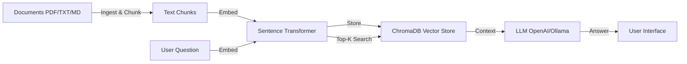
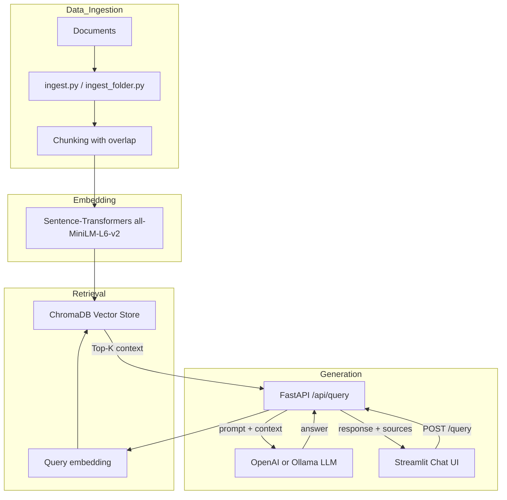

# RAG Document QA Chatbot — Architecture

## 1. High-Level Design

This is a production-style **Retrieval-Augmented Generation (RAG)** application. It ingests unstructured documents, chunks them, embeds the chunks, stores them in a vector database, and uses an LLM to answer user questions based on retrieved context.

---

## 2. Component Diagram

---

## 3. Data Flow

1. **Document Ingestion** — `ingest.py` loads PDF, TXT, or Markdown files, extracts raw text, and splits it into overlapping chunks.
2. **Chunking** — Documents are split into semantically meaningful windows (configurable size + overlap) to preserve local context.
3. **Embedding** — Each chunk is transformed into a dense vector using `all-MiniLM-L6-v2` or a configurable sentence-transformer model.
4. **Storage** — Vectors and metadata (document source, chunk index) are persisted in ChromaDB.
5. **Query** — The user's question is embedded with the same model; a top-K vector search retrieves the most relevant chunks.
6. **Generation** — The retrieved chunks are combined with the original question into a prompt and sent to an LLM.
7. **Response** — The LLM returns an answer, optionally with source references back to the original documents.

---

## 4. Scalability Strategy

- **Embedding Batching:** Chunk vectors are computed in batches to saturate CPU/GPU.
- **Vector Store Scaling:** ChromaDB is suitable for local/small-scale deployments. For production, replace with Pinecone, Weaviate, pgvector, or AWS OpenSearch.
- **API Scaling:** FastAPI is stateless and can be replicated behind a load balancer.
- **Async Ingestion:** Ingestion can be moved to a background worker (Celery, RQ, or cloud queue) for large document sets.
- **Caching:** Cache embeddings and LLM responses to reduce API cost and latency.

---

## 5. Fault Tolerance

- **Idempotent Ingestion:** Document hashes or chunk IDs prevent duplicate ingestion on retry.
- **Graceful LLM Fallback:** If OpenAI is unavailable, switch to a local Ollama model (and vice versa) via the `LLM_PROVIDER` env variable.
- **Persisted Vector Store:** ChromaDB directory is mounted as a volume in Docker and can be backed up to object storage.
- **CI/CD:** GitHub Actions runs `pytest` with mocked LLM and embedding calls, catching regression before deployment.

---

## 6. Failure Recovery

| Failure | Recovery |
|---|---|
| LLM timeout | Retry with exponential backoff; fallback provider if configured. |
| Large document parse error | Catch per-document exceptions and continue processing the rest. |
| Vector store corruption | Restore from the last persisted snapshot or rebuild from documents. |
| Container crash | Docker Compose restarts the service; state is in a persistent volume. |
| Dependency failure | Use environment-driven config to swap embedding or LLM providers. |

---

## 7. Security Considerations

- API keys and LLM credentials are injected via environment variables (`OPENAI_API_KEY`, `LLM_PROVIDER`); see `.env.example`.
- Uploaded documents should be validated for file type and size before processing.
- ChromaDB exposes a local HTTP server in Docker; bind to `localhost` only or place behind an authenticated reverse proxy.
- For production, run the API over HTTPS, add rate limiting, and sanitize user input.
- PII/PHI in documents should be tokenized or restricted based on use case.

---

## 8. Deployment Model

| Target | Command |
|---|---|
| **Local** | `cp .env.example .env` → `pip install -e ".[dev]"` → `uvicorn src.rag_app.api:app --reload` |
| **Docker Compose** | `docker-compose up -d` starts ChromaDB, FastAPI, and Streamlit. |
| **Production** | Deploy the FastAPI container to AWS ECS/EKS, Azure Container Apps, or GCP Cloud Run; use a managed vector store. |

---

## 9. Cost Considerations

- **Local / Dev:** Use Ollama with a small model (e.g., `llama3`) to avoid OpenAI charges.
- **OpenAI:** Implement response caching and set `max_tokens` / `temperature` to control token spend.
- **Vector Store:** ChromaDB is free locally; switch to managed only when vector count or throughput demands it.
- **Embedding Model:** `all-MiniLM-L6-v2` is small, fast, and free. Larger models improve accuracy at higher compute cost.
- **CI/CD:** Mock LLM and embedding calls in tests to keep GitHub Actions costs minimal.

---

## 10. Future Improvements

- Add a managed vector database (Pinecone / Weaviate / pgvector) for horizontal scaling.
- Implement re-ranking of retrieved chunks with a cross-encoder.
- Add conversation memory for multi-turn Q&A.
- Support multi-modal ingestion (images, tables) and web crawling.
- Add observability: OpenTelemetry tracing, latency/error metrics, and user feedback loop.
