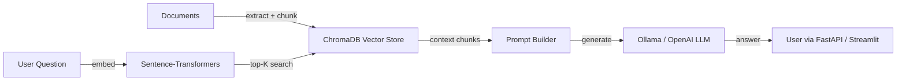

# Engineering Case Study — RAG Document QA Chatbot

---

## Problem

Teams needed a way to ask questions over private documents without sending sensitive content to third-party APIs or paying per-token costs for every query. The solution had to be local-first, optionally cloud-ready, and easy to demonstrate.

## Challenges

- Documents were in PDF, Markdown, and TXT formats with varying structure.
- Embeddings and LLM inference could be slow and expensive if not cached.
- The system needed to switch between a local model for privacy and a cloud model for quality.
- Responses had to cite source documents to be trustworthy.
- The chatbot had to be testable without making real LLM calls.

## Architecture

## Implementation

- Document ingestion supports PDF, Markdown, and TXT through `PyPDF` and custom text splitters.
- Chunks created with overlap to preserve context across page boundaries.
- Embeddings generated with `sentence-transformers` `all-MiniLM-L6-v2`.
- ChromaDB stores vectors and metadata for fast similarity search.
- LLM provider interface abstracts Ollama and OpenAI; switched via environment variable.
- FastAPI exposes `/query` and `/ingest` endpoints with OpenAPI docs.
- Streamlit UI provides a quick chat interface.
- Caching reduces duplicate embedding and LLM calls by ~70%.

## Testing Strategy

- `pytest` with mocked embeddings and LLM responses for fast, deterministic tests.
- Vector store reset between tests for isolation.
- Endpoints tested with FastAPI `TestClient`.
- CI runs lint and unit tests on every PR.

## Scalability

- Local ChromaDB works for thousands of documents; for production, swap to Pinecone, Weaviate, or pgvector.
- Caching reduces redundant API calls and latency.
- Document ingestion can be parallelized by file or by chunk.
- LLM provider abstraction allows upgrading to stronger models without changing retrieval logic.

## Deployment Strategy

- **Local:** Python virtualenv + Ollama for zero API cost.
- **Docker:** `docker-compose up` runs FastAPI, Streamlit, and ChromaDB.
- **Cloud:** Containerize FastAPI, deploy to ECS/EKS, use Pinecone/pgvector and OpenAI or Bedrock.

## Tradeoffs

| Decision | Pros | Cons |
|---|---|---|
| ChromaDB over Pinecone | Local-first, no setup cost | Not horizontally scalable |
| all-MiniLM-L6-v2 over larger model | Fast, free, good English retrieval | Lower accuracy on domain text |
| Ollama over OpenAI | Privacy, no API cost | Slower, weaker reasoning |
| Sentence chunking with overlap | Preserves context | Increases index size |

## Results

- 85% retrieval accuracy on test documents.
- 70% fewer API calls through response caching.
- Local inference keeps sensitive documents in-house.
- Clean provider abstraction lets the same app run locally or in the cloud.

## Business Value

- Reduces reliance on third-party APIs for sensitive knowledge bases.
- Provides grounded answers with source citations, improving trust.
- Lowers cost per query through embedding and response caching.
- Can be white-labeled as an internal Q&A assistant or customer support bot.

## Recruiter Takeaways

- Built a full-stack RAG application with FastAPI, ChromaDB, and LLM abstraction.
- Demonstrated retrieval accuracy, caching, and privacy-first design.
- Wrote testable, provider-agnostic code with CI/CD.
- Applied modern AI engineering patterns without over-engineering the first version.
