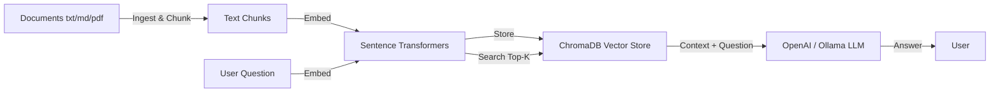

# RAG Document QA Chatbot

A production-style **Retrieval-Augmented Generation (RAG)** application that ingests documents, chunks and embeds them, stores them in a vector database, and answers questions with a local or cloud LLM.

[](https://github.com/Sasireddy001/rag-document-qa/actions/workflows/ci.yml)
[](https://www.python.org)
[](https://fastapi.tiangolo.com)
[](https://www.trychroma.com)
[](LICENSE)

## What this project demonstrates

- **Document ingestion and chunking** for PDF, Markdown, and plain-text files.
- **Dense retrieval** with sentence-transformer embeddings and ChromaDB.
- **LLM answer generation** via an OpenAI-compatible API (Ollama locally, or OpenAI in the cloud).
- **FastAPI backend** with REST endpoints for ingestion and Q&A.
- **Streamlit frontend** for a quick chat UI.
- **Configurable, environment-driven architecture** with `python-dotenv`.
- **CI/CD** with GitHub Actions, pytest, and flake8.

This project is designed as a stepping stone into **AI Engineering**, **RAG systems**, and **LLM application development**.

## Architecture



## Tech Stack

- **Python 3.10+**
- **FastAPI** + **Uvicorn** — REST API
- **Streamlit** — chat UI
- **Sentence-Transformers** — local embedding model (`all-MiniLM-L6-v2`)
- **ChromaDB** — vector database
- **OpenAI Python SDK** — works with OpenAI or Ollama's OpenAI-compatible endpoint
- **PyPDF** — PDF text extraction
- **pytest / flake8 / GitHub Actions**

## Quickstart

### 1. Install

```bash
git clone https://github.com/Sasireddy001/rag-document-qa.git
cd rag-document-qa
python -m venv .venv
source .venv/bin/activate  # On Windows: .venv\Scripts\activate
pip install -e ".[dev]"
```

Copy the environment template:

```bash
cp .env.example .env
```

### 2. Start an LLM backend (choose one)

**Option A — Ollama (recommended for local development)**

1. Install [Ollama](https://ollama.com).
2. Pull a model: `ollama pull llama3`
3. Run the Ollama server: `ollama serve`

**Option B — OpenAI**

Set `LLM_PROVIDER=openai` and add your `OPENAI_API_KEY` to `.env`.

### 3. Ingest documents

```bash
python scripts/ingest_folder.py ./docs
```

or upload files through the API/Streamlit UI.

### 4. Run the FastAPI backend

```bash
uvicorn src.rag_app.api:app --reload --host 0.0.0.0 --port 8000
```

### 5. Ask questions

```bash
curl -X POST http://localhost:8000/query \
  -H "Content-Type: application/json" \
  -d '{"question": "What does this project do?"}'
```

### 6. Launch the Streamlit UI (optional)

```bash
streamlit run src/streamlit_app.py
```

## API Endpoints

| Endpoint | Method | Description |
|----------|--------|-------------|
| `/health` | GET | Health check |
| `/ingest?path=./docs` | POST | Ingest all documents in a folder |
| `/upload` | POST | Upload files and ingest them |
| `/query` | POST | Ask a question and get an answer with sources |

## Project Structure

```text
rag-document-qa/
├── .github/workflows/ci.yml  # GitHub Actions CI
├── .env.example              # Environment template
├── docs/
│   └── ARCHITECTURE.md       # Detailed design notes
├── scripts/
│   └── ingest_folder.py      # CLI ingestion script
├── src/
│   ├── rag_app/              # Core RAG package
│   │   ├── api.py            # FastAPI app
│   │   ├── config.py         # Environment-driven config
│   │   ├── embeddings.py     # Embedding model wrapper
│   │   ├── ingest.py         # File loading and chunking
│   │   ├── llm.py            # LLM client (OpenAI / Ollama)
│   │   ├── query.py          # RAG pipeline orchestration
│   │   └── vector_store.py   # ChromaDB wrapper
│   └── streamlit_app.py      # Chat UI
├── tests/                    # pytest suite
├── pyproject.toml
└── README.md
```

## Testing

```bash
pytest
```

## Docker Deployment

### Using Docker Compose (recommended)

```bash
# Copy environment template and configure
cp .env.example .env

# Start all services (ChromaDB, FastAPI, Streamlit)
docker-compose up -d

# Access services
# FastAPI: http://localhost:8000
# Streamlit: http://localhost:8501
# ChromaDB: http://localhost:8001
```

The Docker Compose setup includes:
- **ChromaDB** — persistent vector database
- **FastAPI backend** — REST API for ingestion and Q&A
- **Streamlit UI** — chat interface

### Using Docker directly

```bash
# Build the image
docker build -t rag-document-qa .

# Run the container
docker run -p 8000:8000 \
  -e CHROMA_HOST=host.docker.internal \
  -e CHROMA_PORT=8000 \
  -e LLM_PROVIDER=openai \
  -e OPENAI_API_KEY=$OPENAI_API_KEY \
  rag-document-qa
```

## Deployment Notes

- The FastAPI app can be deployed with Docker or any ASGI server.
- For production, pin the embedding model and persist the ChromaDB directory to object storage or a managed vector database.
- Replace local ChromaDB with a hosted vector store (Pinecone, Weaviate, pgvector) for horizontal scaling.

## Author

- **Sasidhar Mopuru** — Data & AI Platform Engineer
- [GitHub](https://github.com/Sasireddy001)
- [Portfolio](https://sasireddy001.github.io/Portfolio)
- [LinkedIn](https://www.linkedin.com/in/sasidhar-mopuru-417a03233)
- Email: sasidharmopuru@gmail.com

**Certifications:**
- DP-700: Implementing Data Engineering Solutions using Microsoft Fabric – Microsoft
- Databricks Certified Data Engineer Associate – Databricks

## License

This project is licensed under the [MIT License](LICENSE).
