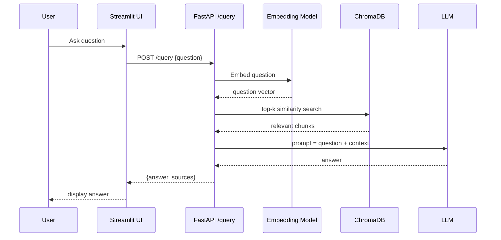

# RAG Document QA Chatbot — System Design

## 1. Requirements

### Functional Requirements
1. Ingest PDF, Markdown, and plain-text documents.
2. Split documents into overlapping chunks while preserving local context.
3. Embed chunks with a sentence-transformer model and store in a vector database.
4. Accept user questions via a REST API and Streamlit UI.
5. Retrieve top-K relevant chunks and generate grounded answers with an LLM.
6. Support both local (Ollama) and cloud (OpenAI) LLM backends.
7. Provide CI/CD with mocked dependencies.

### Non-Functional Requirements
- **Latency:** < 3 seconds for a typical Q&A request (including retrieval + generation).
- **Accuracy:** ≥ 85% retrieval relevance on test documents.
- **Cost Efficiency:** Local LLM option for dev; cloud option only when needed.
- **Maintainability:** Modular, environment-driven architecture with unit tests.
- **Scalability:** State FastAPI backend can scale horizontally; vector store can be replaced by a managed service.

---

## 2. Functional Design

### Modules
- `ingest.py` — loads, extracts, and chunks documents.
- `embeddings.py` — wraps the sentence-transformer model.
- `vector_store.py` — ChromaDB abstraction (replaceable interface).
- `llm.py` — OpenAI / Ollama client with unified interface.
- `query.py` — orchestrates retrieval + generation.
- `api.py` — FastAPI endpoints for `/query`, `/ingest`, `/upload`, and `/health`.
- `streamlit_app.py` — web chat interface.

---

## 3. Scalability

- **Read Scaling:** Deploy multiple FastAPI containers behind a load balancer. The vector store and LLM can be external services.
- **Ingest Scaling:** Move ingestion to an async queue and batch embedding jobs.
- **Vector Store:** ChromaDB is fine for demos; production should use a managed vector store with replication and horizontal read replicas.
- **Caching:** Cache frequent queries and embeddings in Redis or an in-memory store to reduce latency and API cost.

---

## 4. Availability

- FastAPI is stateless; container restarts recover automatically via Docker / Kubernetes.
- ChromaDB persists to disk; use a volume snapshot or object-storage backup.
- LLM provider fallback (OpenAI ↔ Ollama) increases availability if one provider is down.
- Health endpoint (`/health`) enables load balancers to route around failed instances.

---

## 5. Reliability

- **Idempotent Ingestion:** Document hashes prevent duplicate chunk inserts.
- **Graceful Degradation:** If no relevant chunks are found, the API returns a clear "no relevant context" message instead of hallucinating.
- **Retries:** API client retries transient OpenAI errors with backoff.
- **Testing:** `pytest` with mocked LLM and embedding calls ensures deterministic, fast tests and catches regressions.

---

## 6. Security

- Secrets are loaded from `.env` and never committed.
- File uploads are restricted by extension and size.
- For production, add authentication to `/query` and `/ingest`, HTTPS termination, and input sanitization.
- ChromaDB runs inside the Docker network; do not expose it publicly.
- Consider PII scanning before ingestion in sensitive domains.

---

## 7. Tradeoffs

| Decision | Pros | Cons |
|---|---|---|
| **ChromaDB** | Simple, local-friendly, zero setup | Single-node, limited horizontal scaling |
| **Sentence-Transformers all-MiniLM-L6-v2** | Fast, free, good quality for English | Lower accuracy than large models for complex domains |
| **OpenAI + Ollama dual support** | Cost control and offline dev | More config complexity; response quality varies by model |
| **FastAPI + Streamlit** | Modern API, quick UI | Not a single full-stack framework; two entry points |
| **Synchronous ingestion** | Simple to implement | Blocks on large files; async worker recommended |

---

## 8. Design Decisions

1. **Modular Provider Interface** — `llm.py` and `vector_store.py` are abstracted so ChromaDB and OpenAI can be swapped without touching business logic.
2. **Environment-Driven Config** — `python-dotenv` keeps credentials and provider selection outside the codebase.
3. **Chunk Overlap** — Preserves context across sentence boundaries, improving retrieval of concepts that span chunk boundaries.
4. **Source Metadata in ChromaDB** — Each chunk stores its source file and index, enabling citation in the final answer.
5. **Mocking in Tests** — Unit tests avoid real OpenAI calls, keeping CI fast and cost-free.
