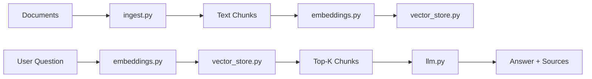

# RAG Document QA — Architecture Notes

## Overview

The application follows a standard **Retrieval-Augmented Generation (RAG)** pipeline:

1. **Ingestion** — documents are loaded from disk, cleaned, and split into overlapping chunks.
2. **Embedding** — each chunk is converted into a dense vector using a sentence-transformer model.
3. **Storage** — vectors and metadata are stored in ChromaDB.
4. **Retrieval** — the user question is embedded and the most similar chunks are retrieved.
5. **Generation** — the retrieved chunks are passed as context to an LLM (Ollama or OpenAI) to generate a grounded answer.

## Design decisions

- **Local-first, cloud-ready:** The default embedding model and ChromaDB run locally. Swap in OpenAI or a managed vector store via environment variables.
- **Modular components:** `ingest`, `embeddings`, `vector_store`, `llm`, and `query` are independent, making it easy to unit test and extend.
- **OpenAI-compatible LLM client:** Using the OpenAI SDK with a configurable `base_url` lets the same code talk to Ollama (`/v1`) or OpenAI without branching logic.
- **Environment-driven config:** All runtime knobs (model names, chunk sizes, DB paths) are loaded from `RAGConfig`, which reads from environment variables and `.env`.
- **CI/CD:** GitHub Actions installs dependencies, runs flake8, and runs pytest on every push.

## Data flow

## Extension ideas

- Replace `ChromaDB` with `Pinecone`, `Weaviate`, or `pgvector` for production.
- Add a re-ranker model (e.g., `cross-encoder/ms-marco-MiniLM-L-6-v2`) after retrieval.
- Add streaming responses from the LLM for a better chat UX.
- Persist conversation history to enable multi-turn RAG.
